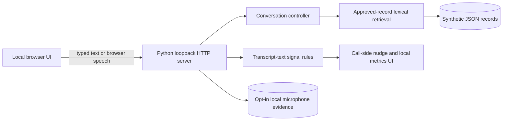

# Knowledge-Grounded Voice Agent Demo

A local prototype for insurance-renewal and installment-reminder conversations. It includes source-linked answers, English / Filipino-Taglish / Bahasa Indonesia examples, scripted checks, and call-side nudges.

> **Demo and privacy boundary:** This workspace contains synthetic policies, synthetic personas, and illustrative language only. It is not connected to an insurer, lender, CRM, payment service, or telephony carrier. Do not enter real customer information, policy or account numbers, payment details, medical information, or credentials. The accompanying [PLAN.md](PLAN.md) describes target requirements and submission evidence; it does not authorize use of real customer data, recording people without their consent, or deployment to production.

## 1. Run the project

### Requirements

- Python 3.10 or newer for the app, import tool, and Python tests.
- A modern browser. Speech recognition and installed voices vary by browser and operating system. Use typed input if speech recognition is unavailable.
- Node.js 18 or newer only if you want to run the browser-runtime tests. The app itself has no Node build step and no `npm install` requirement.
- `pypdf` is optional and only needed to ingest PDF files. HTML, Markdown, text, and CSV ingestion use the Python standard library.

### Windows / PowerShell quick start

Open PowerShell in the project directory (`C:\Users\ASUS\Desktop\ssa`) and run:

```powershell
py -3 --version
py -3 server.py
```

If your Python installation uses `python` instead of the Windows `py` launcher, run `python --version` and `python server.py`. The server prints the local address. Open [http://127.0.0.1:8765](http://127.0.0.1:8765). Keep the terminal open while using the app. Press **Ctrl+C** in that terminal to stop the server.

The server binds to `127.0.0.1` only. Other computers and phones on your network cannot use this address to reach the app.

### Change the local port

The app reads `VOICE_DEMO_PORT` from the process environment; it does **not** load `.env` files automatically. In PowerShell:

```powershell
$env:VOICE_DEMO_PORT = "8766"
py -3 server.py
```

Then open [http://127.0.0.1:8766](http://127.0.0.1:8766). Or pass a one-time port argument:

```powershell
py -3 server.py --port 8766
```

To clear the PowerShell override later, run `Remove-Item Env:VOICE_DEMO_PORT`.

### Optional PDF support

Install `pypdf` only if you need PDF ingestion:

```powershell
py -3 -m pip install pypdf
```

Scanned/image-only PDFs need OCR or manual review; the importer flags PDFs from which it cannot extract text. The app does not require API keys or paid service credentials.

## 2. Try the browser app

1. Open the local URL while `server.py` is running.
2. Choose a call flow: Philippines · English renewal, Philippines · Filipino / Taglish, or Indonesia · Bahasa Indonesia.
3. Check **This is a synthetic test-persona call**. This enables **Start call**.
4. Start a call. Browser speech recognition may ask for microphone permission. The browser may use a browser-managed speech service; its model and network behavior are not exposed by this project. If permission is declined, speech recognition is unavailable, or the browser does not support it, use the typed-message fallback.
5. Use only the demo content. Inspect the source trail after an answer and use the evidence buttons to run repeatable scripted checks.
6. End the call when finished.

The separate **I consent to save my microphone audio and transcript locally** checkbox is off by default. It controls the app's local call-evidence recording; it is not required to try typed chat. If enabled, a recording is saved only when the app receives recognized speech and non-empty microphone audio. The saved audio contains microphone input only; the saved transcript has both speakers, timestamps, status, and source IDs. Generated agent speech is not mixed into the saved audio. This means the current recording feature does not satisfy the plan's complete-call audio-evidence requirement.

The UI includes buttons for the scripted call checks, retrieval evaluation, and nudge logic checks. These are reproducible logic checks; they do not create audio calls or prove speech-recognition quality.

## 3. What is in this prototype

- **Knowledge base:** synthetic JSON records with source metadata, review state, versions, hashes, effective dates, and customer-facing answers.
- **Ingestion:** HTML, Markdown, text, CSV, PDF (with optional `pypdf`), and public HTTPS webpages; section-aware extraction, PII-pattern redaction, deduplication, and review metadata.
- **Retrieval:** weighted lexical search filtered by market, locale, product, category, approval, and effective dates. Unknown or conflicting claims fail closed. Embeddings and vector search are not configured.
- **Conversation logic:** renewal intent, qualification, clarification, objections, unsupported questions, human escalation, and a mock callback action. It does not place calls, create a lead, or contact a representative.
- **Localization examples:** English (`en-PH`), Filipino / Taglish (`fil-PH`), and Bahasa Indonesia (`id-ID`). These are examples for review, not approved scripts or native-speaker sign-off.
- **Call-side nudges:** deterministic text-signal rules for risky claims, missed-opportunity cues, frustration, payment difficulty, callback need, and disclosure reminders. Nudge checks operate on transcript text; there is no real-time audio streaming or timestamped audio replay pipeline in this build.
- **Local evidence:** separate opt-in microphone recording and timestamped, PII-pattern-redacted transcript saving under `evidence/calls/`. Audio evidence remains local and is ignored by Git.

### Architecture



### Project map

| Path | Purpose |
| --- | --- |
| `server.py` | Local HTTP server, API routes, evidence handling, and metrics |
| `agent.py` | Conversation state, response behavior, escalation, and callback intent |
| `knowledge.py` | Source extraction, redaction, record schema, deduplication, retrieval, and citations |
| `nudges.py` | Transcript-signal rules, cooldown, expiry, localization, and percentile calculations |
| `web/` | Browser interface, styles, and small browser-runtime helpers |
| `data/demo_kb.json` | Synthetic demo knowledge records |
| `data/test_scenarios.json` | Synthetic scripted conversation cases |
| `data/eval_queries.json` | Ten labeled retrieval questions across five categories |
| `data/unsupported_queries.json` | Unsupported-claim test case |
| `data/localization_examples.json` | Three adaptation examples for each market |
| `scripts/` | Repeatable ingestion, scenario, and retrieval commands |
| `tests/` | Python and browser-runtime tests |
| `evidence/` | Generated synthetic reports and ignored local call evidence |
| `.env.example` | Local port note; the app does not parse `.env` |

## 4. Use approved source material

The demo corpus is synthetic. To use a real business source, first obtain authorization and have the appropriate content owner confirm the source, jurisdiction, effective date, wording, and permitted use. Do not treat a successful import as approval to answer customers.

The importer defaults to `needs_review`, which keeps imported records out of answers until a responsible reviewer has checked and approved them. Example for a local PDF:

```powershell
py -3 scripts/ingest_kb.py .\approved-source.pdf `
  --market PH `
  --locale en-PH `
  --product life `
  --category policy `
  --version 2026-01
```

Supported source types are `.html`, `.md`, `.txt`, `.csv`, `.pdf`, and public `https://` webpage URLs. Webpage import needs network access. Set metadata to match the source, not the example values above.

By default, successful imports merge into `data/imported_records.json`; existing imported data is preserved if extraction entirely fails. `--replace` replaces that imported dataset only after at least one record was extracted. Review extracted text, source references, redactions, and warnings before approving records. Only then may an authorized content reviewer re-run the import with `--review-status approved`. For agent behavior rules, use `--record-type agent_guidance` and supply reviewed spoken wording with `--response-text`.

After importing, stop and restart the server so it reloads records. The app loads both `data/demo_kb.json` and `data/imported_records.json`. Imported data and call recordings are excluded by `.gitignore`; do not remove those protections casually or publish sensitive source material.

## 5. Run tests and generate reports

From the project directory:

```powershell
py -3 -m unittest discover -s tests -v
py -3 -m compileall -q .
node --check web/app.js
node --check web/runtime.js
node --test tests/frontend.test.cjs
py -3 scripts/run_scenarios.py
py -3 scripts/evaluate_kb.py
```

The application has no `npm install` or database setup step. The Python unit tests and browser-runtime test file need no project dependency install beyond the listed runtimes.

Expected generated files:

- `evidence/scenario_results.json`: scripted conversation results. The report labels itself as a logic simulation and records `audio_recordings: 0`.
- `evidence/retrieval_results.json`: ten labeled synthetic queries (two each for product, policy, qualification, FAQ, and objection) plus one unsupported query, with retrieval details and verdicts.

At the time this README was expanded, the project passed **63 Python tests**, **3 browser-runtime tests**, **11/11 scenario checks**, and **11/11 retrieval checks**. Re-run the commands above after changes; generated reports reflect the latest local run and should be reviewed before submission. These checks do not measure ASR accuracy, voice quality, insurer policy correctness, or real-time audio latency.

## 6. Deliverables required by the project plan

Use this checklist as the submission tracker. It distinguishes current prototype files from evidence that still has to be produced. Do not mark an item complete just because a test, source file, or demo screen exists; attach the evidence the acceptance gate asks for.

| Deliverable | What the final submission should contain | Current prototype status |
| --- | --- | --- |
| Source and scenario freeze | Source inventory with owner, revision, jurisdiction, permission; approved rules and prohibited claims; synthetic personas; scenario/test matrix | Synthetic scenarios exist. No real approved business corpus was supplied. |
| Traceable knowledge base | Versioned records, schema, reviewed extraction/cleaning report, source links/sections, index or retrieval-method version, approval/effective-date status | Synthetic `data/demo_kb.json`, schema/retrieval code, and hashes exist. No real-source cleaning report exists. Retrieval is lexical; no vector index is configured. |
| Retrieval evaluation | At least 10 labeled queries covering all five categories, one unsupported case, citation/source, relevance explanation, verdict, and reproducible results | `data/eval_queries.json`, `data/unsupported_queries.json`, and `evidence/retrieval_results.json`; 11/11 synthetic checks passed. |
| English renewal agent | Five consented test-persona calls: cooperative, objection, incomplete/conflicting details, out-of-scope question, and human-help request; audio, timestamped transcript, citations, expected/observed result, verdict, safe fallback, mock action output | Conversation logic and 11 scripted cases exist. **The five audio calls and complete-call recordings are outstanding.** |
| Localization | Philippine English/Filipino/Taglish and Indonesian formal/colloquial flows; at least three adaptation examples per market; provider/model/locale/voice settings; observed ASR/TTS errors; two or three recorded calls per market; Indonesian regional-accent test and qualified language review | Three text adaptations per market and scripted flows exist. Recordings, settings/quality report, accent sample, and native-speaker/compliance reviews are outstanding. |
| Live nudges | Four real-time replays (missed opportunity, skipped disclosure/risky claim, frustration, noisy ambiguity); nudges shown before call end; logs, false-positive/suppression review, P50/P95 component/end-to-end latency, machine/network conditions, scale notes | Text-signal rules and nudge logic checks exist. **Real-time audio replay, full timing evidence, and the four replay outcomes are outstanding.** |
| Submission package | Reproducible setup, architecture, sample inputs, `.env.example`, result-to-requirement matrix, secret/PII scan, evidence index, approved accessible recording/video links | README, architecture, examples, setup, `.env.example`, and synthetic reports exist. Create the final evidence index/result matrix and run/document a submission secret/PII scan. |
| Walkthrough video | A reviewer-facing video showing the grounded answer/citation, unsupported fallback, localized flows, live nudge during streaming playback, measured latency, limitations, privacy gaps, and next steps | **Video not yet produced.** Current app has no streaming audio/replay path, so it cannot truthfully demonstrate the plan's live-streaming nudge gate. |

### Acceptance gates to sign off

- **Grounding:** every factual product/policy statement in test scenarios traces to a current approved record; unsupported/conflicting cases do not invent claims.
- **Voice flow:** all five Q1 scenarios have recorded outcomes; human assistance and callback requests are captured.
- **Retrieval:** ten or more labeled questions cover product, policy, qualification, FAQ, and objection, with citation and verdict per query.
- **Localization:** at least two recorded calls per market (the plan targets three), mixed-language and regional-accent cases, three adaptation examples per market, and documented speech settings/errors.
- **Live insights:** four required real-time cases, visible nudges before playback/call ends, P50/P95 timing breakdown, and false-positive/suppression notes.
- **Submission:** setup is reproducible, no credentials or customer PII are included, and every artifact is accessible to the intended reviewer.

The project is currently a **partial prototype**: the logic, local UI, synthetic retrieval reports, and documentation are implemented, while the human audio, accent, real-time replay, and video gates above remain unverified or outstanding.

## 7. Make the walkthrough video

The project plan asks for a walkthrough that shows the product working and states its limitations. A video is a separate submission artifact; it is not generated by running the app or its tests.

### Prepare the demo

1. Run the project and open the local URL. Confirm the app says it uses synthetic demo content.
2. Close unrelated windows and browser tabs. Turn on Do Not Disturb / Focus Assist and hide notifications. Check the browser address bar and desktop for personal information, passwords, private files, and API keys.
3. Use only the synthetic personas and demo policies. Prepare the sequence below so the recording has no long pauses or accidental personal speech.
4. If recording a human voice, get each participant's informed permission for the screen/video recording. The app's recording-consent checkbox governs its local microphone-audio evidence only; a separate screen recorder may also capture voices and system audio.
5. Decide whether the video is a **prototype walkthrough** or the **final acceptance walkthrough**. The final version must wait until real-time audio/replay and the other outstanding acceptance items have been implemented and tested.

### Recommended 4–6 minute walkthrough sequence

| Approx. time | Show and say |
| --- | --- |
| 0:00–0:30 | Project name, synthetic-data notice, and high-level architecture. State that the app is local and not connected to a financial institution or CRM. |
| 0:30–1:30 | Start a synthetic English renewal call or use the typed fallback. Ask a supported renewal question, show the response and source trail, and explain the citation. |
| 1:30–2:00 | Ask an unsupported coverage or eligibility question. Show the safe fallback/escalation behavior. Do not present demo facts as real contract terms. |
| 2:00–2:45 | Show the Filipino/Taglish and Indonesian localized flows/examples. If voice is used, state the browser/locale and that native-speaker and accent quality are not yet validated. |
| 2:45–3:30 | Show a nudge using the available text-based nudge logic check and explain its evidence signal, priority, cooldown, and expiry. State clearly that this prototype does not stream audio or perform real-time audio replay. |
| 3:30–4:15 | Show the retrieval/scenario reports and current metric panel. Explain that synthetic test counts and local timings are not speech-quality or production-latency measurements. |
| 4:15–5:30 | End with remaining acceptance work: consented recordings, localization/accent review, real-time replays and latency report, complete-call audio, privacy/compliance review, and production integrations/controls. |

This sequence is suitable for an honest prototype walkthrough. To satisfy the **final** plan gate, replace the text-only nudge demonstration with an actual required real-time replay showing the nudge before the replay ends, and include real measurements and evidence. Do not edit or narrate the video in a way that makes a scripted text check look like live audio streaming.

### Record with OBS Studio (recommended when the video needs system audio)

OBS can capture the browser window or display, desktop audio, and an optional microphone. Use the official [OBS Quick Start Guide](https://obsproject.com/kb/quick-start-guide) and [Standard Recording Output Guide](https://obsproject.com/kb/standard-recording-output-guide) for current setup and format details.

1. Install OBS Studio from its official source if it is not already available. Use the recording-focused Auto-Configuration Wizard.
2. In a scene, add a **Window Capture** for the browser (or **Display Capture** if the walkthrough requires switching windows). Crop or arrange the frame so the app is readable and unrelated desktop details are out of view.
3. Check the **Audio Mixer**. Enable desktop/system audio to capture browser speech output. Enable a microphone only if the narration or test-speaker audio is needed and consented. Confirm the meters move and that they are not clipping.
4. In OBS recording settings, choose a local output folder and test a short clip. OBS recommends a resilient recording format such as MKV; if the submission portal specifically requires MP4, use OBS's remux feature after the recording or select a compatible format as appropriate.
5. Start the app, begin OBS recording, follow the walkthrough sequence, then stop recording. Play the saved file from beginning to end and verify that the screen is legible and expected audio is present.
6. Trim dead air and accidental notification/desktop exposure. Preserve the meaning of test results; do not remove failures or imply a result passed if it did not.
7. Save an approved copy as `evidence/walkthrough/voice-agent-demo.mp4`, or store the video in an approved access-controlled location and put its reviewer-accessible link in the evidence index. Do not commit large or sensitive participant recordings without approval.

### Windows built-in alternative

Windows 11's Snipping Tool supports video snips: open Snipping Tool, select **Record → New** (or use **Win+Shift+R**), select the region, start, and stop the capture. See [Microsoft's Snipping Tool instructions](https://support.microsoft.com/en-us/windows/apps/use-snipping-tool-to-capture-screenshots). Verify the saved clip's audio before relying on this method; use a recorder with explicit desktop-audio controls when browser speech must be audible.

### Video quality and privacy checklist

- Use a readable browser zoom and keep the app in view; avoid tiny text and excessive cursor movement.
- Record at a consistent resolution, preferably 1080p / 30 fps where the computer can handle it. Unless the reviewer specifies otherwise, aim for about 4–6 minutes.
- Use a concise narration, captions, or brief title cards. Identify synthetic data, scripted checks, and prototype-only behavior clearly.
- Play the exported file on another player before submission. Check opening, ending, audio synchronization, clipping, black frames, and that the video contains the complete explanation.
- Review the whole file for real names, contact details, customer content, policy/account numbers, credentials, private desktop notifications, and unconsented voices. Redact or re-record before sharing.
- Provide access only through an approved reviewer destination. A local file path is not a share link for a remote reviewer.

## 8. Evidence and privacy handling

- `evidence/scenario_results.json` and `evidence/retrieval_results.json` are generated synthetic test reports.
- `evidence/calls/` is intended for opt-in local test audio and JSON transcripts. The folder is Git-ignored except for its `.gitkeep` placeholder. Audio contains microphone input only; transcripts contain both speakers and are redacted for common PII patterns. Regex redaction is not comprehensive PII detection.
- Screen-recording a walkthrough is a separate activity from saving call evidence inside the app. Obtain consent for all recorded voices and check the finished video for sensitive content.
- Before submission, inspect staged files and run a secret/PII scan. `.gitignore` reduces accidental inclusion but does not replace a scan or an access-control review.
- Delete local audio evidence when it is no longer needed. Do not store recordings in an unrestricted shared location.

## 9. Limitations and troubleshooting

### Known limitations

- The knowledge base contains invented demo-only rules because no approved business source was provided. Replace them and obtain content-owner approval before any domain use.
- Browser-managed ASR/TTS models and settings are not exposed. Filipino/Taglish switching, `fil-PH`, Indonesian `id-ID`, regional accents, latency, and voice quality need consented speaker testing and native-speaker review.
- Nudges analyze transcript text. The app does not stream audio in timestamped chunks or replay audio at real-time speed. Dashboard timings are local UI/API samples; LLM is not used.
- The saved call audio is microphone-only. A complete two-sided call audio path is needed for the plan's complete-call audio-evidence gate.
- The callback is a mock intent; there is no CRM, outbound callback, telephony carrier, payment processing, durable database, authentication, TLS, cloud storage, or production deployment control.
- The prototype is designed for one local demonstration. It has not been load-tested or approved for customer-facing financial or insurance decisions.

### Troubleshooting

| Problem | What to check |
| --- | --- |
| `py` or `python` is not found | Install Python 3.10+ and reopen PowerShell, or use the Python launcher configured on your machine. |
| Port 8765 is already in use | Stop the existing demo with Ctrl+C or choose another port using `--port 8766`. |
| Browser page cannot connect | Keep the server terminal open; use the exact localhost URL and matching port printed by the server. |
| Start call is disabled | Check the synthetic test-persona box. |
| Speech input does not work | Check browser microphone permission and browser support. Use typed fallback if ASR is blocked or unavailable. Browser ASR can be browser-managed. |
| Local audio is not saved | Saving requires app recording consent, recognized speech, captured microphone audio, a supported browser recorder, and synthetic test-persona confirmation. Typed-only turns do not create audio evidence. |
| No PDF text was imported | Install `pypdf`; image-only/scanned PDFs need OCR or manual extraction and review. |
| Imported records do not appear | Confirm they are approved, in scope for the market/locale/product/category, and effective today; restart the server after import. |
| Results differ after edits | Rerun the tests and both report scripts; they write new JSON reports under `evidence/`. |

