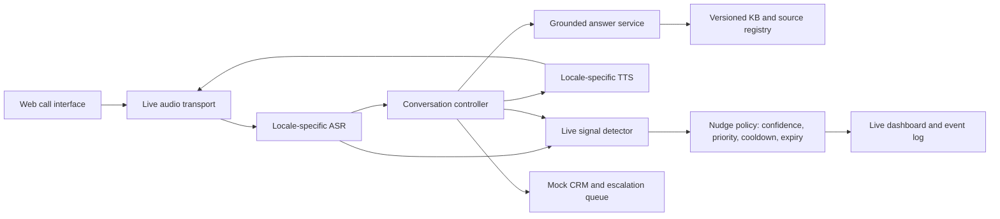

# Draft delivery plan: knowledge-grounded voice agents and live call nudges

## 1. Proposed scope

Build one connected demonstration covering all four questions in the brief. Use **insurance renewal** for Question 1, **Philippine life-insurance renewal** and **Indonesian installment reminder** for Question 3, and a live Philippine renewal call for Question 4. These choices reuse the same call infrastructure and knowledge-base service. They are draft choices; replace them if the supplied script or business rules require another use case.

Use synthetic or explicitly approved business content and test personas. Do not use real customer records, process payments, make binding eligibility or coverage decisions, or represent invented policies as real policies. Recordings require participants' consent. The final system is a demonstrable prototype; production deployment needs domain, legal, privacy, and native-speaker review.

**Success condition:** A reviewer can open the web calling interface, complete a grounded call, inspect the cited records used in its answers, hear the two localized prototypes, watch a nudge appear before a call ends, and reproduce the tests from the repository.

## 2. Architecture

**Recommended starting stack:** Python service and agents, a small React web interface, LiveKit for browser audio transport, Azure Speech for separate `fil-PH` and `id-ID` ASR/TTS configurations, and PostgreSQL with pgvector plus full-text search for the knowledge base. Keep model and speech providers behind adapters so measured language quality can justify a change. LiveKit has a React voice frontend path and Azure Speech integrations; Azure lists Filipino and Indonesian speech capabilities; pgvector supports vector and full-text hybrid retrieval. Confirm account access, region availability, and actual voice quality during the first spike. Sources: [LiveKit frontend](https://docs.livekit.io/frontends/start/react-quickstart/), [LiveKit Azure integration](https://docs.livekit.io/agents/integrations/azure/), [Azure language support](https://learn.microsoft.com/en-us/azure/ai-services/speech-service/language-support), [pgvector](https://github.com/pgvector/pgvector).

The conversation controller owns allowed actions and state. The knowledge base owns business facts. Prompts contain behavior rules and tool instructions, while product, policy, FAQ, and objection content is retrieved from versioned records at call time. Answers include source IDs in the internal transcript; the bot speaks a concise answer and admits when evidence is absent or conflicting.

## 3. Delivery sequence

### Phase 0 — Source and scenario freeze

1. Obtain the supplied call script, business rules, source webpages/PDFs/forms/tables, and any allowed sample data. Record the owner, URL/file, revision date, jurisdiction, and permission to use each source.
2. Define the three call scenarios above, their allowed claims, required disclosure wording, qualifying fields, escalation triggers, and prohibited actions. Mark unknown rules as unavailable until approved.
3. Create a synthetic test corpus and personas. Write an evaluation matrix before tuning the bot.

**Exit evidence:** source inventory, approved rule sheet, scenario scripts, test matrix, and a diagram of the intended call flow.

### Phase 1 — Question 2: traceable knowledge base

1. Extract webpage main content and parse documents, tables, and forms. Preserve page/section/table references. Log failed extraction and visibly erroneous source content for review.
2. Remove navigation, repeated headers/footers, and unrelated text. Normalize terms, dates, field names, and categories; detect exact and near duplicates. Detect PII, redact it from indexed text, and retain only approved non-sensitive metadata.
3. Create a versioned schema: `record_id`, `title`, `content`, `category`, `product`, `market`, `locale`, `source_id`, `source_uri`, `source_section`, `effective_from`, `effective_to`, `version`, `pii_status`, `review_status`, and `content_hash`. Keep source documents and chunks linked.
4. Chunk by heading and semantic unit, keeping policy conditions and exceptions together. Index keywords and embeddings. Retrieve with market/product filters, combine lexical and vector ranking, rerank the top results, and reject stale, unapproved, or weak evidence.
5. Expose a retrieval endpoint that returns answerable evidence with record IDs and citations. On conflicting sources, prefer the currently approved version or ask for human review; never silently choose an outdated policy.
6. Evaluate at least **10 queries**, two each for product, policy, qualification, FAQ, and objection. For each, record the question, retrieved chunk, source reference, relevance explanation, and correct/partial/incorrect verdict. Include one intentionally unsupported question.

**Exit evidence:** sample records, schema, extraction/cleaning report, index version, query results, citation examples, and a working retrieval interface.

### Phase 2 — Question 1: grounded English renewal agent

1. Build the browser call interface and configure one English voice pipeline. Show connection state and a visible recording notice.
2. Implement a state machine: greeting and consent → basic identity-safe context → renewal intent/details → grounded FAQ or objection handling → summary and next step → close. Evaluate qualification using explicit, approved business rules and show the rule path in the call result; ask for clarification when details are incomplete or conflict, and make no eligibility claim when the rules do not support one.
3. Call the KB tool for product/policy/FAQ/objection answers. Require a source match before making a factual business claim. For unknowns, say information is unavailable and offer escalation or callback in the same conversation.
4. Add one optional business action: write a **mock CRM summary and callback request** with consent, structured fields, source citations, and escalation reason. Do not create a real customer lead by default.
5. Record **five calls** so each required case is visible: cooperative, objection, incomplete/conflicting details, out-of-scope question, and human-assistance request. Save audio, timestamped transcript, retrieved source IDs, expected result, observed result, and verdict.

**Exit evidence:** callable web link or documented local web interface, call flow, five recordings and transcripts, safe fallback, and mock action output.

### Phase 3 — Question 3: localized market prototypes

1. Create separate locale configurations and scripts: Philippine life-insurance renewal in English, Filipino, and Taglish; Indonesian installment reminder in formal and colloquial Bahasa Indonesia. Keep dates, currency, politeness, and finance terms natural to each market.
2. Test `fil-PH` and `id-ID` ASR separately, including English loanwords and Taglish. Test Filipino and Indonesian TTS voices and document any compromise. Do not assume automatic language identification can handle word-level switching: Azure documents that continuous identification does not detect language changes within one sentence. Measure actual behavior and use clarification or locale-specific vocabulary prompts where needed. Source: [Azure language identification](https://learn.microsoft.com/en-us/azure/ai-services/speech-service/language-identification).
3. Test an Indonesian regional accent outside standard Jakarta speech using a consented speaker or labeled sample. Report sample origin, ASR errors, terminology errors, and whether intent/critical fields were captured; avoid claiming general accent support from one sample.
4. Prepare at least **three localization examples per market** showing a natural local phrasing, the direct-translation alternative it replaces, and the reason for the adaptation.
5. Record at least **three calls per market** to cover cooperative behavior, sector objection, mixed finance terms, colloquial speech, human escalation, and the Indonesian accent. Preserve the customer's language/register in fallback and escalation.

**Exit evidence:** six or more recordings and transcripts, provider/model/locale/voice settings, approximate ASR quality and error examples, adaptation table, and native-speaker/compliance gaps.

### Phase 4 — Question 4: nudges during the call

1. Stream audio from a live call or replay a recording at real-time speed in timestamped chunks. Emit partial/final transcripts with speaker labels where available and report transcription latency per chunk.
2. Track intent/topic shifts and detect a small, testable signal set: required disclosure not yet given by the relevant stage, an approved rider buying signal or missed offer, rising frustration, payment difficulty, and callback need. Use deterministic checks for required script facts and a constrained classifier for softer signals.
3. Gate nudges by evidence and confidence. Deduplicate by call/topic, apply a cooldown, prioritize compliance, expire stale nudges, and suppress low-confidence/noisy events. Keep the text short and actionable.
4. Display nudges on a live dashboard through WebSocket and log timestamps for audio receipt, ASR, signal detection, LLM classification/generation where used, and delivery. Calculate observed P50/P95 end-to-end and component latency for ASR, signal extraction, LLM, and delivery; state sample size and machine/network conditions.
5. Run at least **four real-time replays**: missed cross-sell, skipped disclosure/risky statement, rising frustration, and noisy ambiguous audio. Label expected nudges and false positives. Show at least one compliance and one missed-opportunity nudge before the call ends.

**Exit evidence:** recorded live demo, signal rules, nudge log, latency report, false-positive review, and notes on 10× scale and noisy audio.

### Phase 5 — Submission and walkthrough

1. Publish one repository with clear folders for `kb`, `agent`, `locales`, `nudges`, `web`, `tests`, and `evidence`. Include a README, architecture diagram, sample inputs, setup/run commands, `.env.example`, and a secret/PII scan. Store large or sensitive recordings in an access-controlled location and link only approved artifacts.
2. Produce a result sheet mapping every requirement to a test and artifact. Separate observed success from known limitations.
3. Record a walkthrough showing a grounded call, cited KB answer, unsupported-question fallback, both localized flows, and a nudge appearing during streaming playback. End with measured latency, language limitations, privacy/compliance gaps, and production improvements.

**Exit evidence:** reproducible repository, evidence index, recordings/transcripts, results, and video.

## 4. Acceptance gates

| Area | Pass condition |
| --- | --- |
| Grounding | Every factual policy/product answer in the scripted tests traces to an approved current KB record; unsupported and conflicting cases avoid invented claims. |
| Voice flow | All five Question 1 scenarios complete with a recorded outcome; human assistance and callback requests are captured. |
| Retrieval | At least 10 labeled queries include all five required knowledge categories and a citation/verdict per query. |
| Localization | At least two recorded calls per market (plan: three), required mixed-language/accent cases, three adaptation examples per market, and documented ASR/TTS settings and observed errors. |
| Live insights | Nudges appear before the replay/call ends; four required scenarios, timing breakdown with P50/P95, and documented false positives and suppression behavior. |
| Submission | Setup works from documented environment variables; repository contains no credentials or customer PII; evidence and video are accessible to reviewers. |

## 5. Schedule and dependencies

Allow approximately **15–20 working days for one engineer**, with access to the materials and service accounts from day one: 1–2 days for scope and source review, 3–4 for the KB, 3–4 for the base voice agent, 3–4 for localization and speaker testing, 3–4 for live nudges, and 2–3 for validation and submission. These are planning estimates, not measured effort. The critical path is **approved content → KB → grounded agent → localized calls → live evaluation**. Nudge instrumentation can start once live audio/transcripts are available.

The main dependencies are the actual provided script and business rules, approved source content, voice/API credentials, a consented Indonesian accent sample, and ideally native-speaker review for both markets. If time is constrained, keep the web calling interface, mock CRM action, and real-time replay demonstration; those satisfy the core evidence without telephony procurement or production CRM integration.
